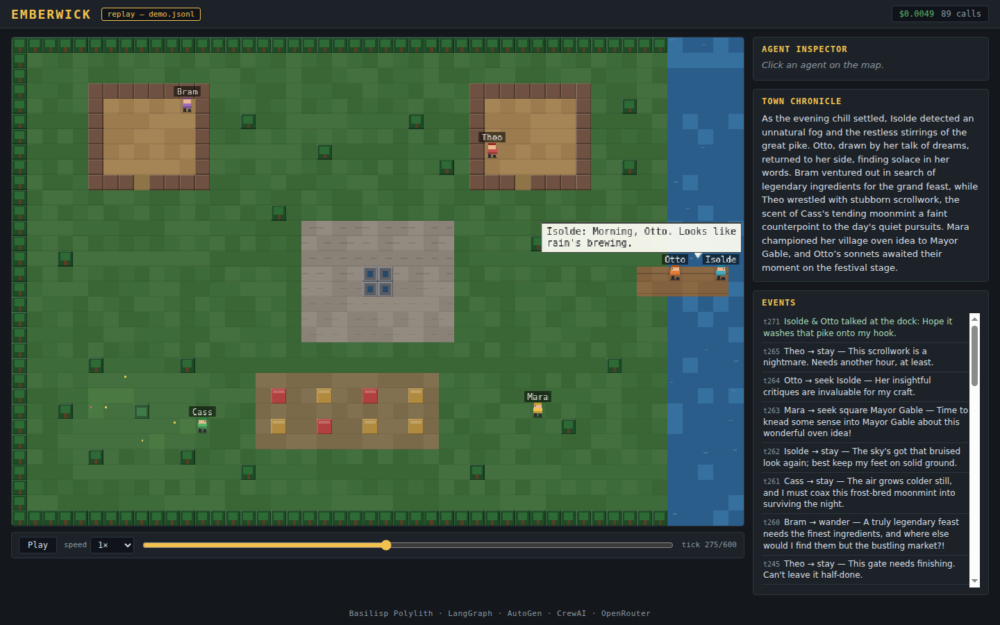

# Agent World — Emberwick

Six LLM-powered villagers live in a 2D pixel town: they decide where to go
(**LangGraph**), talk when they cross paths (**AutoGen**), and a town
chronicler narrates it all (**CrewAI**) — orchestrated from a **Basilisp
(Clojure-on-Python) Polylith monorepo** over **OpenRouter**, behind a hard
fail-before-spend cost cap.

**Live demo (static replay, zero backend):**
<https://agent-world-three.vercel.app>



## Why three orchestrators?

Not framework tourism — each one does the job it's actually shaped for:

| Framework | Job here | Why it's the right tool |
|---|---|---|
| **LangGraph** | Per-agent cognition: each decision is a compiled `StateGraph` (`perceive → decide → conditional route → set-target / idle`) | Decisions are *stateful control flow with branching* — exactly what a graph of nodes with conditional edges models. The LLM node is a swappable callable, so tests run the whole graph with zero network. |
| **AutoGen** | Proximity conversations: when two agents meet, a `RoundRobinGroupChat` of two persona-primed agents talks (≤ 6 messages, 80 max tokens each) | Multi-turn dialogue between distinct personas is AutoGen's native shape — turn-taking, termination conditions, and per-message `models_usage` come for free. |
| **CrewAI** | The Town Chronicle: every 2 sim-minutes a two-agent crew (chronicler → editor) rewrites the running narrative from the raw event log | A fixed role/task pipeline with task-to-task context handoff is CrewAI's sweet spot — the editor task consumes the chronicler task's output declaratively. |

All three run against the same cheap OpenRouter model
(`google/gemini-2.5-flash-lite`) through one shared inference component with
a single cost guard.

> **Microsoft Agent Framework note:** AutoGen's lineage is converging into
> the Microsoft Agent Framework. This demo pins `autogen-agentchat 0.7.x`;
> the conversation component isolates AutoGen behind a single
> `converse!` interface, so migrating to MAF (or anything else) is a
> one-component swap.

## Architecture

```
                    ┌───────────────────────────────────────────────┐
                    │  engine (tick loop, 1 sim-minute = 60 ticks)  │
                    │   · movement every tick (deterministic RNG)   │
                    │   · decision slot: round-robin, 1 agent /     │
                    │     20 ticks  ──────────▶ cognition (LangGraph)│
                    │   · proximity pairing ──▶ conversation (AutoGen)│
                    │   · every 120 ticks ────▶ chronicle (CrewAI)  │
                    │   · every event ────────▶ recorder (sanitize) │
                    └───────┬───────────────────────────┬───────────┘
                            │                           │
        components:         │                           │
        world (grid/places) │      inference (OpenRouter client,
        persona (6 villagers)│       model registry, COST GUARD:
        memory (per-agent)  │       reserve! → call → settle!)
                            │                           │
              ┌─────────────┴──────────┐   ┌────────────┴────────────┐
              │ bases/headless         │   │ bases/server            │
              │ CLI: max-speed run →   │   │ FastAPI: WS /ws/state,  │
              │ sanitized replay JSONL │   │ /api/*, serves viewer   │
              └───────────┬────────────┘   └────────────┬────────────┘
                          │                             │
                          ▼                             ▼
              replays/demo.jsonl ──▶ browser viewer (plain canvas JS)
              (static on Vercel)     live WS mode ⇄ replay mode,
                                     same renderer for both
```

Polylith bricks: `components/` = `world`, `persona`, `memory`, `cognition`,
`conversation`, `chronicle`, `inference`, `engine`, `recorder`;
`bases/` = `headless` (CLI) and `server` (FastAPI + viewer);
`projects/demo` documents how to run it.

### Basilisp + Polylith, in one paragraph

[Basilisp](https://basilisp.readthedocs.io/) is Clojure that compiles to
Python bytecode — you get immutable data, REPL-driven development, and
Lisp macros while calling `langgraph`, `autogen`, and `crewai` natively
through Python interop (no bridges, no subprocesses).
[Polylith](https://polylith.gitbook.io/) organizes the code as small
single-purpose "bricks": components only talk to each other through
`interface.lpy` namespaces, and bases are the only entry points. The
discipline is enforced by two gate scripts (`scripts/compile_check.py`,
`scripts/check_deps.py`) since the python-polylith CLI can't parse `.lpy`.

## Quick start

```bash
python3 -m venv .venv && .venv/bin/pip install -e .
export OPENROUTER_API_KEY=sk-or-...   # only needed for live LLM modes

# 1) LIVE viewer — real LangGraph/AutoGen/CrewAI calls, ~$0.01 per 10 min:
.venv/bin/basilisp run -n agentworld.base.server -- --port 8700 --seed 42
# open http://127.0.0.1:8700/

# 2) STUB viewer — deterministic no-LLM stubs, zero spend, no key needed:
.venv/bin/basilisp run -n agentworld.base.server -- --port 8700 --stub --seed 42

# 3) REPLAY — no backend at all; what the Vercel deploy serves:
#    open http://127.0.0.1:8700/?replay=/replays/demo.jsonl
#    (or any static file server over bases/server/resources/public/)

# Record a new replay (headless, max speed):
.venv/bin/basilisp run -n agentworld.base.headless -- \
    --minutes 10 --out bases/server/resources/public/replays/demo.jsonl --seed 42

# Build + deploy the static bundle:
scripts/build_static.sh          # → dist/
cd dist && vercel deploy --prod  # → https://agent-world-three.vercel.app
```

Gates: `scripts/test.sh` (pytest), `scripts/compile_check.py`,
`scripts/check_deps.py`, `scripts/check_public_hygiene.py`.

## Cost model

The whole point of the cost guard is that these numbers are *enforced*, not
hoped for. Every LLM call is `reserve!`d at worst-case price **before** it
is dispatched; the guard refuses the dispatch if the reservation would
cross `AGENT_WORLD_MAX_SPEND_USD` (default $1.00). Actuals are `settle!`d
from provider usage after each call.

Canonical 10-sim-minute demo run (seed 42, the bundled replay):

| Metric | Value |
|---|---|
| Sim time | 10 minutes (600 ticks) |
| LLM calls | 195 (180 decisions, 10 conversations, 5 chronicles) |
| **Total spend** | **$0.0113** |
| Replay size | 337 KB (`replays/demo.jsonl`) |

Per-call economics on `google/gemini-2.5-flash-lite`
($0.10 in / $0.40 out per Mtok):

| Call type | Bound | Typical cost |
|---|---|---|
| LangGraph decision | 1 call, bounded `max_tokens` | ~$0.00004 |
| AutoGen conversation | ≤ 6 messages × 80 tokens, reserved as one unit | ~$0.0004 |
| CrewAI chronicle | 2 tasks (chronicler + editor), reserved as one unit | ~$0.0008 |

## Security notes

- **Fail-before-spend cost cap** — preflight estimate checked against
  `AGENT_WORLD_MAX_SPEND_USD` *before* every dispatch; AutoGen/CrewAI
  internal calls are covered by whole-unit reservations.
- **Sanitized replays** — the recorder whitelists event fields at the emit
  boundary; prompts and keys are structurally excluded, and
  `scripts/check_public_hygiene.py` gates everything that ships.
- **XSS-hardened viewer** — all LLM-derived text renders via `textContent`
  or canvas `fillText`, never `innerHTML`; `replays/malicious.jsonl` is a
  fixture proving HTML payloads stay inert. Replay sources are restricted
  to same-origin `/replays/*.jsonl`.
- **Local bind by default** — the live server binds `127.0.0.1`; a
  non-local `--host` refuses to start without `AGENT_WORLD_CONTROL_TOKEN`,
  and `/api/control` then requires the matching header (nobody on the LAN
  triggers LLM spend).

## Repo tour

| Path | What |
|---|---|
| `components/engine/` | Tick loop, decision/conversation/chronicle scheduling, worker pool |
| `components/cognition/` | LangGraph `StateGraph` per-agent decisions |
| `components/conversation/` | AutoGen `RoundRobinGroupChat` dialogues |
| `components/chronicle/` | CrewAI chronicler+editor crew |
| `components/inference/` | OpenRouter client, model/price registry, cost guard |
| `components/recorder/` | Event sanitizer + JSONL replay writer |
| `bases/headless/` | CLI: max-speed sim → replay artifact |
| `bases/server/` | FastAPI live server + the canvas viewer (`resources/public/`) |
| `projects/demo/README.md` | Detailed run/replay instructions |
| `specs/agent-world-demo/` | The spec this was built from (research → plan → phases) |

Art is intentional colored-rect pixel style drawn in canvas — no external
assets, no build step, nothing to attribute.
